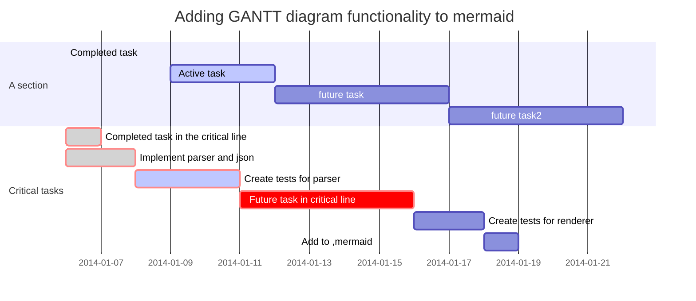

```mermaid
gantt
　　　dateFormat　YYYYMMDD
　　　title Adding GANTT diagram functionality to mermaid
　　　section A section
　　　Completed task　　:done, des1, 2014-01-06,2014-01-08
　　　Active task 　　　　:active, des2, 2014-01-09, 3d
　　　future task 　　　　:　　　  des3, after des2, 5d
　　　future task2　　　　:　　　  des4, after des3, 5d
　　　section Critical tasks
　　　Completed task in the critical line　:crit, done, 2014-01-06,24h
　　　Implement parser and json　　　　　　:crit, done, after des1, 2d
　　　Create tests for parser　　　　　　　:crit, active, 3d
　　　Future task in critical line　　　　　:crit, 5d
　　　Create tests for renderer　　　　　　:2d
　　　Add to ,mermaid　　　　　　　　　　　:1d
```

H~2~O

==key==

X^2^
